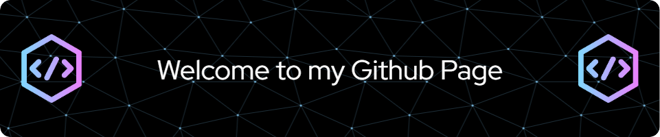

<h1 align="center">Hi 👋, I'm Melih Görgülü</h1>
<h3 align="center">Passionate about Machine Learning/ Computer Vision</h3>

  

- 🔭 I pursued a Master's degree in Informatics at the Technical University of Munich, where I conducted a thesis on 3D computer vision for autonomous drivingunder the supervision of Professor Cremmers in the Computer Vision Group. [https://cvg.cit.tum.de/](https://cvg.cit.tum.de/)

<h3 align="left">Languages and Tools:</h3>

          

&nbsp;

